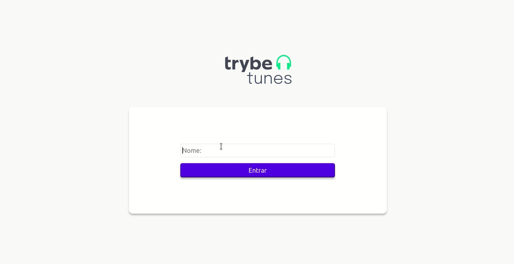

# Boas-vindas ao repositório do projeto TrybeTunes!
Projeto desenvolvido no curso da Trybe ao final do bloco 12* do Módulo 2 - Desenvolvimento Front-end.  
*<strong>Bloco 12: Ciclo de Vida de Componentes e React Router</strong> 
 12.1 - Ciclo de vida de componentes 
 12.2 - React Router 
 12.3 - Projeto - TrybeTunes 
 
 No projeto <strong>TrybeTunes</strong> foi desenvolvida uma aplicação tendo como página inicial o Login. Após entrar é possível procurar álbuns através do nome do artista/banda e ouvir um pedaço das músicas destes álbuns. As músicas favoritadas são salvas e ficam armazenadas na página favoritos. Também é possível atualizar o perfil do usuário.

Veja o resultado: https://nataliafranceschi.github.io/12-Project-TrybeTunes/
 
 
